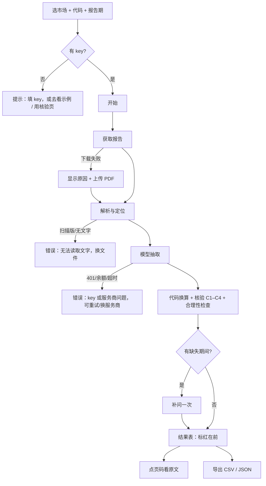

# 财报数字核验：网页产品需求文档（PRD）

| 项目 | 内容 |
|---|---|
| 产品 | 财报数字核验 / Earnings Verifier（2026-10-07 由“有据 / Cited”改名）：从美股、A 股、港股的定期报告里抽取核心财务数字，每个数字附页码和原文，并用纯代码核验，把可疑的数标红 |
| 线上地址 / 代码 | https://earnings-verifier.streamlit.app/ / https://github.com/bwu109-netizen/earnings-verifier |
| 版本 | v0.1，2026-10-06，初稿。已并入 `docs/prd_verify_page.md`（核验页），该文件随后删除，以本文件为准 |
| 风格参考 | 用户的 Stitch 项目「Financial Trading Dashboard UI」的设计系统（只借视觉，不借内容，见 §6） |
| 范围 | 只做网页呈现和交互。抽取、核验、评估逻辑全部复用 `earnings_agent/`，不改核心模块（deny 规则见 `.claude/settings.local.json`）。网页代码全部放在 `web/` |
| 不做 | 跨期追踪、点评生成（明天再定） |

---

## 1. 产品概述

### 1.1 一句话定义

输入市场、代码和报告期，自动下载财报，抽出营业收入、归母净利润、基本 EPS、毛利、经营现金流等核心数字。每个数字都附页码和原文，再用纯代码做一遍核验，核验不过的标红并说明原因。

### 1.2 背景

- 卖方研究员每季度都要从几十份财报里抄数。直接问 AI 很快，但 AI 给的数没有出处，错了也不会告诉你。
- 本项目第 1–2 阶段做了抽取流水线和核验层，并在 60 份评估集、60 份留出集上测过，结果在 `docs/eval_results.md`。
- 评估的结论并不是“流水线更准”。在 DeepSeek 上，专业写法的直接问严格正确率最高；流水线的价值在于每个数都有页码和原文，可疑的数会被标出来，需要人工复核的范围可以缩小。页面必须如实呈现这一点（§1.5）。

### 1.3 目标与可验证标准

| 目标 | 可验证的标准 |
|---|---|
| 一眼看懂 | 首页首屏 5 秒内能回答：这是什么、给谁用、不填 key 能看什么 |
| 免 key 也能看懂 | 招生官不填任何 key，能看到 3 份示例结果、能用核验页、能读方法与评估页 |
| 可追溯 | 结果表每一行都有页码和原文；点页码能看到原文那一页 |
| 可疑项优先 | 标红条目排在最前，每条用一句话说明原因 |
| 诚实 | 页面上的评估数字全部来自 `docs/eval_results.md`，出处标明到节；禁用语（§1.5）一条都不出现 |
| 手机可用 | 375px 宽度下，示例结果、核验页、方法页都能完整浏览 |

### 1.4 不在本次范围

- 跨期追踪、点评 / 研报生成
- 账号、登录、历史记录（结果只在当前会话里）
- 改动核心模块的抽取、核验或评估逻辑

### 1.5 诚实规则（所有页面、所有语言、包括 Stitch 原型）

1. 评估数字只能来自 `docs/eval_results.md`，并在旁边注明出处：节号，以及是冻结版、修订版还是留出集。
2. 禁止出现以下说法，以及任何意思相同的改写：
   - “比直接问 AI 更准” / “more accurate than asking AI directly”
   - “零静默错误” / “zero silent errors”
   - “全部错误都会被标出” / “catches every error”
   - “已验证无误”“100% 准确” / “verified correct” / “100% accurate”
3. 状态 ✅ 只能写“通过核验” / “Passed checks”，不写“正确” / “correct”。
4. 不出现 Stitch 编造的内容，包括：编造的宣传语、用户数、客户 logo、评价、置信度分数、“本地处理 / 不存储”这类我们没有实现或没有验证的承诺、运行编号、头像。原型里有的，在实现阶段改成真话或删掉，并逐条告诉用户。
5. 隐私说法只写已经实现的。例如“你的 key 只用于本次请求，不写入服务器文件”，前提是代码确实这样做了。

---

## 2. 用户

| 用户 | 他们想要什么 | 对设计的要求 |
|---|---|---|
| 卖方研究员（主要用户） | 很快拿到一份财报的核心数字，能核对出处，知道哪些数要自己再看一眼；能做几家公司的口径统一对比 | 结果表信息密度高；标红项排在最前；页码一点就到；有批量对比和币种切换；导出 CSV |
| 招生官 / 评审（访客） | 没有 API key，几分钟内看懂项目做了什么、做得怎么样、局限在哪 | 首页直接放示例；有免 key 的核验页；方法与评估页清楚、数字有出处；有英文版；手机可读 |

---

## 3. 场景与主流程

### 3.1 场景

1. **研究员看一份新财报**：在单家分析页填 `hk / 00700 / 2026H1`，点“开始”，看进度，读结果表，先处理标红项，点页码核对原文，最后导出 CSV。
2. **研究员对比同业**：在批量对比页填 5 个代码，得到口径统一的对比表，切到上市地货币，看汇率来源和日期。
3. **招生官快速浏览**：打开首页，点一份示例结果，再去方法与评估页看三档对比和局限，最后跳到 GitHub。
4. **任何人核验别的 AI 的结果**：在核验页上传财报 PDF，粘贴另一个 AI 按通用提示词给出的结果，得到同样的结果表，可疑项标红。

### 3.2 主流程（单家分析）



---

## 4. 信息架构

### 4.1 页面

| 编号 | 页面 | 需要 key | 调用模型 |
|---|---|---|---|
| P1 | 首页 / 示例 | 否 | 否（3 份预跑结果） |
| P2 | 单家分析 | 是 | 是 |
| P3 | 批量对比 | 是 | 是 |
| P4 | 核验 | 否 | **否** |
| P5 | 方法与评估 | 否 | 否 |

### 4.2 布局规则

- 顶部导航固定显示 5 个页面，右侧是“中 / EN”切换和 GitHub 链接。手机上导航收进菜单。
- 结果出现后，输入区折叠成一行摘要，例如“港股 · 00700 · 2026H1 · DeepSeek”，点“修改”展开。
- 单家分析的结果表、示例结果、核验结果用**同一个结果组件**（R1），只是表头上方的说明不同。
- “原文页”用右侧抽屉打开，手机上改为全屏弹层。

### 4.3 骨架

```
┌ G1 导航：Logo · 首页 · 单家分析 · 批量对比 · 核验 · 方法与评估 · [中/EN] · GitHub ┐
│                                                                              │
│  P2 单家分析                                                                   │
│  ┌ M1 输入卡：市场 ▾  代码 [     ]  报告期 [2026H1 ▾]  服务商 ▾  Key [••••]  [开始] ┐
│  └──────────────────────────────────────────────────────────────────────────┘
│  ┌ M2 进度：获取报告 ✓ · 解析定位 ✓ · 模型抽取 … · 核验 · 补问 ┐
│  ┌ R0 报告摘要：公司 · 报告标题 · 期末日 · 模板 · 页数 · 花费 · 原文链接 ┐
│  ┌ R1 结果表：标红 2 条 · 通过核验 4 条 · 无可比数据 3 条      [导出 CSV] ┐
│  │ ❌ 毛利  · 1,234 · 百万元 · 半年 · p.12 · “……”  原因：数字不在第 12 页上 │
│  │ ✅ 营业收入 · …                                                   │
│  ┌ R2 行业指标（核验 C1–C3）┐
│  └ R3 抽取说明与局限（固定文案）┘
└ G2 页脚：评估数字出处 · 局限摘要 · GitHub · MIT ┘
```

---

## 5. 模块

### G1 导航 / G2 页脚

- G1 见 §4.2。当前页高亮。
- G2 页脚固定写两句局限。第一句：“核验只能确认数字在原文里、单位对、和其他数自洽，不能确认它就是你要的指标。”第二句：“未标红不等于正确。”另附方法与评估页链接。

### P1 首页 / 示例

- **M1 首屏**：一句话定义、给谁用，以及两个按钮：“看示例结果”（锚点到示例区）和“分析一份财报”（去 P2）。按钮下一行小字：“不需要 API key 也能看示例、用核验页。”
- **M2 示例卡 × 3**：美股、A 股、港股各一份，从评估集选，预跑结果存在 `web/examples/*.json`。每张卡写公司、报告、期末日，以及“标红 n 条 · 通过核验 n 条 · 无可比数据 n 条”。点进去用 R1 组件展示完整结果，原文页可点。
  - 候选（待确认，§14）：
    - 美股 TSLA 2026Q2：核心字段全部通过核验；辅助字段“普通股股东应占净利润”的 Q 和 H 与 SEC XBRL 差 200 万美元，被标红，可以展示标红和原因。
    - A 股中国石油 2025FY 年报：长文档；辅助字段“营业成本”与东财符号相反，被标红。
    - 港股小米 2026H1：有单季和累计；⚠️ 多，可以说明港股没有可比数据。
  - 数据来源：用 eval1 已缓存的模型回复，按当前产品规则（R1–R6）重新核验，不花钱，也不再调用模型。卡片上注明“示例为预跑结果”。示例卡上的数字是结果表里的条数，不是评估指标。
- **M3 三步说明**：“下载并定位报表页 → 模型照抄数字和原文 → 代码换算和核验”。每步一句话，不加修饰性形容词。
- **M4 评估摘要**：从 `eval_results.md` §3（留出集）取 3 个数字，同时注明出处和样本，例如“留出集 40 份美股 + A 股，流水线严格正确 96.1%，DeepSeek”。点击去 P5。具体取哪 3 个见 §11.3。

### P2 单家分析

**M1 输入卡**

| 控件 | 必填 | 默认 | 说明 |
|---|---|---|---|
| 市场 | 是 | 港股 | 美股 / A 股 / 港股 |
| 代码 | 是 | 空 | 占位符按市场切换：`AAPL` / `600519` / `00700`；港股自动补齐 5 位 |
| 报告期 | 是 | 最近一期 | 下拉：`2026H1`、`2026Q3`、`2026FY`…… 旁边有“?”，解释非自然年财年（例如 MSFT 6 月财年） |
| 服务商 | 是 | DeepSeek | 沿用 review-insight 的服务商列表（`earnings_agent/llm_client.PROVIDERS`）：DeepSeek、Gemini、OpenAI、Claude、Qwen、Kimi、GLM、其他 OpenAI 兼容服务 |
| 模型 | 否 | 服务商默认 | 文本框，可改 |
| Base URL | 选“其他”时必填 | 空 | |
| API key | 是 | 空 | 密码框，旁边有“去哪里申请”链接。只放在当前会话内存里，不写文件、不写日志 |

- 校验不用弹窗：不合格时在字段下方显示红字，“开始”按钮灰掉。
- “开始”后进入后台线程，进度推送沿用 review-insight 的组件消息协议。可以“停止”。

**M2 进度**：分为获取报告、解析与定位、模型抽取、核验、补问（仅在有缺失期间时出现）五步。当前步骤后面显示一个动态点，完成的打 ✓，失败的标红并显示原因。抽取这一步显示已用 tokens 和花费（来自 `llm.usage` / `llm.cost_usd`）。

**M3 下载失败 → 上传 PDF**：获取报告失败时显示原因（例如“HKEXnews 没有找到 2026H1 业绩公告”），并显示上传区。上传后从“解析与定位”继续。上传的文件只在本次会话中处理。

**R0 报告摘要**：公司名、代码、报告标题、报告类型（10-Q / 中期业绩公告…）、期末日、披露日、行业模板（通用 / 银行 / 保险）、总页数、送给模型的页数、花费，以及原文链接。

**R1 结果表（共用组件）**

| 列 | 内容 |
|---|---|
| 状态 | ❌ 需要复核 / ✅ 通过核验 / ⚠️ 无可比数据（C1–C3 通过，但没有结构化数据可比） |
| 指标 | 中文名 / 英文名，例如营业收入、归母净利润；推导项标“推导” |
| 数值 | 原文写法（例如 `401,243`）+ 换算后（例如 `4,012.43 亿`）；币种按原文报告币种 |
| 单位 | 原文单位（例如“人民币百万元”） |
| 期间 | 单季 / 半年 / 年初至今 / 全年 / 时点，加期末日 |
| 页码 | `p.12`，可点，打开原文页抽屉 |
| 原文引用 | 模型照抄的那一行，过长时截断，悬停或展开看全文 |
| 原因 | 只有 ❌ 和 ⚠️ 有：一句话说明，例如“数字 1,234 在第 12 页找不到”“单季 + 上季末累计 ≠ 半年累计”“与 SEC XBRL 不一致（差 10⁶ 倍）”。点开看全部失败的检查和证据 |

- 排序：❌ 在最前，然后 ⚠️，最后 ✅；同一状态内按指标的固定顺序。
- 表头上方一行统计：“需要复核 n · 通过核验 n · 无可比数据 n”。
- 推导项（毛利 = 营收 − 营业成本，拨备前利润等）可以展开，看各组成项的页码和原文。
- **辅助字段**（普通股股东应占净利润、营业成本、加权平均股数、每 ADS EPS）放在核心字段下面的折叠区“辅助字段”里，状态和原因照常显示；折叠区标题上写明其中有几条 ❌。它们被核验，但不是核心指标。
- “漏抽”（报告期应有但没抽到）作为 ❌ 行出现，数值写“未取得”。
- 导出 CSV 和 JSON。文件名为 `<market>_<code>_<period>.csv`。

**R1a 原文页抽屉**

- PDF 来源：显示该页渲染的图片，用 pdfplumber 渲染，不增加依赖；下面是该页解析文字，命中的数字高亮。
- SEC HTML 来源：显示解析后的分页文字，命中处高亮，再给一个原文链接。
- 抽屉顶部写“第 n 页 / 共 N 页”，可以翻到前后一页。

**R2 行业指标**：模型给出 3–6 个行业特色指标，每个都有理由、页码和原文，只做 C1–C3 核验，没有 C4。单独成表，表头写明“只核验了出处和单位”。

**R3 抽取说明（固定文案）**：说明流水线每一步做了什么，以及 C1–C4 和合理性检查分别检查什么、不检查什么；链接到 P5。

### P3 批量对比

- **输入**：选一个市场，或者混合多个市场（每行一个“市场 + 代码”）；报告期统一选择；最多 10 家。服务商和 key 与 P2 共用。
- **进度**：每家一行，显示各自的步骤和状态。单家失败不影响其他家，失败的那行显示原因，并提供“上传 PDF”。
- **结果：对比表**
  - 行 = 公司，列 = 核心字段（按行业模板对齐；银行和通用公司混在一起时，银行的毛利列写“不适用”，净利息收入列只对银行有值）。
  - 每格显示数值和状态图标；❌ 格标红，悬停看原因；点格子打开那家公司的 R1 结果表。
- **币种切换**：“原币种 / 上市地货币”（美股 USD、港股 HKD、A 股 CNY）。规则来自 metrics_spec 的币种规则 2、3：
  - 换算时每个被换算的格子旁边都标汇率：来源、日期、类型（期末汇率 / 期间平均汇率）。
  - 表头写明用的汇率表。
  - 随时能切回原币种。
  - 汇率取不到时不换算，标“汇率缺失”。
  - 汇率数据源待定（§14）。
- **导出** CSV：原币种和换算后的数各一列，汇率信息另起一列。

### P4 核验（免 key，不调用任何模型）

> 由 `docs/prd_verify_page.md`（2026-10-06）并入。

**目的**：用户已经让别的 AI 按我们的通用提示词读过一份财报，想知道哪些数靠不住。本页用现有核验层做纯代码检查，把可疑项标红并说明原因。不需要 key，不调用任何模型，解析用户粘贴的结果也用代码完成。财报和 AI 结果都不会发给任何模型服务商。

**输入**

| 输入 | 必填 | 说明 |
|---|---|---|
| 财报 PDF | 是 | 用现有解析（`parse.pdf_pages`：pdfplumber + NFKC）按页取文字 |
| AI 结果 | 是 | 粘贴文本：JSON，或表格（Markdown 表格、从网页复制的制表符分隔表格）。格式见“结果格式” |
| 市场 | 是 | 决定币种默认规则（例如 A 股单独的“元”= 人民币），以及能否做 C4 |
| 报告期 | 是 | 确定目标期末，判断给的是不是本期数、是单季还是累计 |
| 股票代码 | 否 | 美股和 A 股填了才可能做 C4 |
| 行业模板 | 否 | 默认按利润表结构自动判定（`templates.choose_template`），可以手动改 |

**检查**（全部复用现有核验层，不另写规则）

| 检查 | 做什么 | 条件 |
|---|---|---|
| C1 引用在页上 | 引用能否在它说的那一页（±1 页）找到 | 要有页码和引用。缺了记为“无出处，无法核验”，标红 |
| C2 数字在页上 | 数字本身是否逐字出现在那一页 | 没给页码时，在全文搜这个数，列出出现的页，仍标红为“无出处” |
| C3 单位 / 币种 | 单位和币种能否解析；每股指标倍数为 1；仙、美分按 0.01 换算 | 总是做 |
| 合理性检查 S1–S5 | 毛利 ≤ 营收、归母 ≥ 普通股、推导值 = 明示值、EPS × 股数 ≈ 净利润、单季 + 上季累计 ≈ 累计 | 需要的数都在时才做。S5 需要结构化数据，条件同 C4 |
| C4 结构化数据比对 | 美股比 SEC XBRL，A 股比东财 | **仅美股和 A 股**，填了代码且能取到这一期的数据时才做；美股用代码 + 报告期找到对应申报（`sources.fetch_us(download=False)`），找不到就跳过。**港股不做 C4**：东财港股数据可能换算过币种，不可靠 |
| 期间判定 / 漏抽 | 报告期应有、AI 没给的字段和期间 | 现有 `expected_pairs` |

- 状态与 R1 一致；另外新增一种 ❌ 分类“无出处”。
- 表头写明本次做了哪些检查，例如“C1–C3 + 合理性检查；未做 C4（港股没有可靠的结构化数据）”或“未做 C4（未填代码）”。

**结果格式**（依赖“通用提示词”，明天做）

- JSON：按流水线抽取格式，`items[]` 里每项有 `field`、`raw_value`、`raw_unit`、`raw_currency`、`period_type`、`period_end`、`page`、`quote`，推导项再加 `derivation`、`components`。
- 表格：代码按表头识别列，至少要有指标、数值、单位、期间；页码、原文两列可选。认不出的列名，让用户手动对应列，不调用模型。
- 先做格式校验。无法解析的行单独列出，标明是第几行；这些行不参与核验，也不会被悄悄丢掉。
- 粘贴区旁边放“通用提示词”入口，先写“明天提供”。

**新代码位置**：解析粘贴结果的代码放在 `web/`，核心模块只 import，不改。

**不做**：不替用户修正数字；不保存上传的 PDF 和粘贴内容，处理完即丢；扫描版 PDF 取不到文字时直接提示，不出结果表。

### P5 方法与评估

数字全部来自 `docs/eval_results.md`，每张表下面注明出处（节号，以及冻结版、修订版还是留出集）。

- **M1 方法**：流水线五步，以及 C1–C4 和 S1–S5 各检查什么。配一张简单流程图，用 SVG，不用插画。
- **M2 三档对比**：
  - 主表用冻结版 eval1 全量三地（§1.1）。
  - 附表用留出集 40 份美股 + A 股的四档（§3），并注明修订是看过结果后做的，留出集用于验证修订。
  - 列：严格正确、静默错误、复核工作量、标记召回率（含 C4 / 去 C4）。
  - **必须原样呈现**：专业直接问的严格正确率高于流水线；流水线和核验档的优势在于静默错误少、有页码可追溯。不写成“流水线更准”。
- **M3 标记召回率分市场**（必做）：美股 + A 股一组、港股一组，分开展示，不合并成一个数。港股组写明“较低”，原因有三：
  1. 港股没有可靠的结构化数据，C4 基本不起作用；
  2. 美股和 A 股的“含 C4”召回率存在循环，因为 C4 和标准答案同源，所以同时给出去 C4 的数；
  3. 港股的错误主要来自以“仙 / 美分”列示的 EPS，产品已修复（R6），但港股没有留出集，未经验证。
- **M4 Fable 小样本**：9 份，单独成表，标明“小样本，仅作参考”。
- **M5 局限**：照抄 `eval_results.md` 第 4 节的要点，包括：
  - 核验层不检查指标是否真的存在；
  - 人工标“原文没有”的 12 项中各档给数的次数；
  - 输入是解析文本，不是 PDF；
  - 港股留出集未评；
  - 修订是看过结果后做的。
- **M6 链接**：GitHub 仓库、`eval_design.md`、`eval_results.md`。

---

## 6. 视觉规范

**风格参考**：用户的 Stitch 项目「Financial Trading Dashboard UI」中的设计系统 “Institutional Terminal Precision”（2026-10-07 确定）。完整 token 和组件规则见 `docs/stitch/DESIGN.md`。

**借什么**：深色终端式底色，1px 细线分隔，4px 小圆角，信息密度高的表格和卡片；Inter 配 JetBrains Mono 的双字体；状态徽章的样式。

**不借什么**：参考项目里所有交易看板内容一律不要，包括 K 线、涨跌幅、实时行情、盘口、行情代码滚动条。参考页面里的示例文案和数字也不用，例如 “OCR 置信度 99.84%”、自由现金流行、头像，以及 “0 条静默错误……漏报率为 0”，后者违反 §1.5。参考页面里另有一套亮绿主色的 “Robinhood” 变体，**不采用**：绿色在本产品中只表示“通过核验”，主色若也用绿色会混淆状态含义，所以主色用设计系统里的天蓝。

### 6.1 颜色

| token | hex | 用途 |
|---|---|---|
| canvas | #0b0d11 | 页面底色、表头行、输入框 |
| panel | #12151c | 卡片、面板、表格行 |
| elevated | #1a1e27 | 悬停行、菜单、抽屉 |
| hairline | #262c38 | 1px 边框和分隔线 |
| hairline-strong | #3a4254 | 悬停 / 选中边框 |
| text | #f1f5f9 | 主文字 |
| text-muted | #94a3b8 | 次要文字、元数据 |
| text-faint | #64748b | 单位、列名、提示 |
| accent | #38bdf8 | 主按钮、焦点、当前导航、链接（悬停 #7dd3fc） |
| accent-2 | #6366f1 | 原文引用里的交叉链接，少用 |
| bad | #f43f5e | ❌ 需要复核（底 rgba(244,63,94,0.12)，边 rgba(244,63,94,0.30)） |
| warn | #f59e0b | ⚠️ 无可比数据（底 rgba(245,158,11,0.12)，边 rgba(245,158,11,0.30)） |
| ok | #10b981 | ✅ 通过核验（底 rgba(16,185,129,0.12)，边 rgba(16,185,129,0.30)） |

红、琥珀、绿只用于这三种核验状态，而且总是和图标、文字一起出现；不用于装饰，也不表示涨跌。

### 6.2 字体

- Inter 用于正文、控件和标题，开启表格数字（tnum）；中文回退 Noto Sans SC、PingFang SC。
- JetBrains Mono 用于所有数字、代码、期间、页码标记和大写列名。

| 级别 | 字体 | 字号 / 行高 | 字重 | 字距 |
|---|---|---|---|---|
| display（仅首页大标题） | Inter | 40 / 48 | 600 | -0.02em |
| headline-xl | Inter | 24 / 32 | 600 | -0.02em |
| headline-lg | Inter | 18 / 24 | 600 | -0.015em |
| headline-md | Inter | 15 / 20 | 600 | -0.01em |
| body-md | Inter | 13 / 18 | 400 | 0 |
| body-sm | Inter | 12 / 16 | 400 | 0 |
| data-lg | JetBrains Mono | 16 / 20 | 500 | -0.01em |
| data-md | JetBrains Mono | 12 / 16 | 500 | -0.01em |
| data-sm | JetBrains Mono | 11 / 14 | 400 | 0 |
| label-caps | JetBrains Mono | 10 / 12 | 600 | +0.06em，大写 |

### 6.3 形状、间距、层次

- 圆角：卡片、输入框、表格 4px；徽章 2px；抽屉最大 6px。不用胶囊按钮。
- 间距用 4 / 8px 栅格；表格行高 32px（紧凑 28px），表头 28px；桌面内容最大宽度 1280px。
- 层次只靠底色深浅和 1px 细线表现；不用柔和阴影、渐变或光晕。菜单可以用一道锐利阴影 `0 4px 12px rgba(0,0,0,0.7)`。

### 6.4 组件

- **主按钮**：accent 底、#0b0d11 字、高 32px。**次按钮**：panel 底加 hairline 边。
- **状态徽章**：图标 + 文字，高 20px，等宽 10px 大写。
- **指标表**：数字右对齐、等宽字体；文字左对齐、Inter；❌ 行在最前，指标名下面一行写原因。
- **页码链接**：`p.5`，等宽字体、accent 色。
- **原文引用**：等宽 11px、text-muted 色，放在 canvas 底加细线框里，命中的数字用 rgba(56,189,248,0.15) 高亮。
- **原文页抽屉**：右侧，宽 420px。

### 6.5 动效

只有三处：
1. 进度步骤的当前点做脉冲（1.2s 循环）；
2. 抽屉滑入（160ms）；
3. 悬停时底色过渡（120ms）。

`prefers-reduced-motion` 时全部关闭。

### 6.6 硬约束（不随风格变）

- 状态不能只靠颜色区分。
- 数字一律用表格数字。
- 不用照片、3D、插画或 emoji 装饰。
- 图表只在 P5 出现，而且只用简单条形图或表格。

---

## 7. 交互规则

- **校验**：字段下方显示红字，不弹窗；“开始”在必填项齐全前保持禁用。
- **自动识别**：港股代码补齐 5 位；A 股代码 6 位，按开头判断交易所；美股代码转大写。
- **切换服务商**：保留已填的代码和报告期，清空 key，模型名和 Base URL 换成新服务商的默认值。
- **切换语言**：保留全部输入和结果，只换界面文字。指标名按语言显示，原文引用保持原文。
- **结果保留**：同一会话里重新分析会覆盖上一份结果，覆盖前提示。批量对比可以只重跑失败的那几行。
- **导出**：CSV（UTF-8 with BOM，Excel 打开不乱码）、JSON。
- **外链**：原文链接在新标签页打开。
- **key**：只存会话内存；页面上写“只用于本次请求，不写入服务器文件”（实现时核实代码确实如此再写）。
- **花费**：单家分析和批量对比都显示本次调用的花费估算（按 `config.PRICES`），并注明“估算”。

---

## 8. 状态

| 状态 | 位置 | 中文文案 | English | 下一步 |
|---|---|---|---|---|
| 空（P2） | 输入卡下 | 填好市场、代码和报告期即可开始。没有 key？先看示例，或用核验页。 | Pick a market, ticker and period to start. No key? Browse the examples or use Verify. | 去 P1 / P4 |
| 获取中 | M2 | 正在从 {source} 获取报告…… | Fetching the report from {source}… | 停止 |
| 下载失败 | M3 | 没有拿到这份报告：{reason}。你可以上传 PDF 继续。 | Couldn't fetch this report: {reason}. Upload the PDF to continue. | 上传 |
| 扫描版 | M2 | 这份 PDF 取不到文字（可能是扫描件），无法抽取和核验。 | No text could be read from this PDF (likely a scan). | 换文件 |
| key 错误 | M2 | 服务商拒绝了这个 key（401）。请检查 key 或换服务商。 | The provider rejected this key (401). | 改 key |
| 余额 / 限流 | M2 | 服务商返回 {code}：{message} | Provider returned {code}: {message} | 稍后重试 |
| 部分完成 | R1 上方 | 有 {n} 项没取到（已补问一次），在表中标为“未取得”。 | {n} items could not be extracted (asked once more) and are marked "not found". | — |
| 无可比数据 | R1 表头 | 港股没有可靠的结构化数据，⚠️ 表示出处和单位已核验，但没有外部数字可比。 | HK has no reliable structured data; ⚠️ means source and unit checked, no external figure to compare. | — |
| 核验页：无法解析的行 | P4 | 第 {rows} 行无法解析，未参与核验。 | Rows {rows} could not be parsed and were not checked. | 修改后重试 |

---

## 9. 手机（375 × 812）

- 导航收进菜单；语言切换放在菜单顶部。
- R1 结果表改成卡片列表，每条一张卡：状态和指标在第一行，数值和期间在第二行，页码和原因在第三行；原文引用默认折叠。
- 原文页抽屉改为全屏弹层。
- 批量对比表只能横向滚动，首列（公司名）固定。
- 可点区域 ≥ 44px。
- **验收路径**：首页 → 打开港股示例 → 点一条 ⚠️ 的页码看原文 → 返回 → 核验页上传 PDF、粘贴 JSON → 看结果 → 方法页读完三档对比。全程不出现横向滚动条，对比表除外。

---

## 10. 文案表（关键字符串）

| key | 中文 | English |
|---|---|---|
| nav.home | 首页 | Home |
| nav.analyze | 单家分析 | Analyze |
| nav.compare | 批量对比 | Compare |
| nav.verify | 核验 | Verify |
| nav.method | 方法与评估 | Method & evaluation |
| hero.title | 从财报里抄数，每个数都带出处 | Numbers from filings, each with its source |
| hero.sub | 美股、A 股、港股定期报告：抽取核心财务数字，附页码和原文，用代码核验，可疑的标红。 | US, A-share and HK filings: core figures with page and quote, checked by code, suspicious ones in red. |
| hero.cta1 | 看示例结果 | See examples |
| hero.cta2 | 分析一份财报 | Analyze a filing |
| hero.nokey | 不需要 API key 也能看示例、用核验页。 | No API key needed for the examples or Verify. |
| status.bad | 需要复核 | Needs review |
| status.ok | 通过核验 | Passed checks |
| status.warn | 无可比数据 | No external figure |
| col.metric / value / unit / period / page / quote / reason | 指标 / 数值 / 单位 / 期间 / 页码 / 原文引用 / 原因 | Metric / Value / Unit / Period / Page / Quote / Reason |
| verify.title | 核验别的 AI 给的数 | Check figures from any AI |
| verify.sub | 上传财报 PDF，粘贴 AI 按通用提示词给出的结果。纯代码检查，不调用任何模型，不需要 key。 | Upload the filing PDF and paste an AI's answer. Code-only checks: no model, no key. |
| verify.prompt_soon | 通用提示词：明天提供 | Universal prompt: coming soon |
| footer.limit1 | 核验只能确认数字在原文里、单位对、和其他数自洽，不能确认它就是你要的指标。 | Checks confirm a number is in the filing, in the right unit and consistent, not that it is the metric you asked for. |
| footer.limit2 | 未标红不等于正确。 | Not flagged does not mean correct. |
| example.note | 示例为预跑结果 | Pre-computed example |
| method.hk_low | 港股的标记召回率较低：港股没有可靠的结构化数据可比对。 | Flag recall is lower for HK: there is no reliable structured data to compare against. |
| fx.note | 汇率：{source}，{date}，{type} | FX: {source}, {date}, {type} |

完整文案在实现时放进 `web/i18n.json`，以本表为准。

---

## 11. 前端可用的数据

**只能显示下列字段，不能显示别的。**

### 11.1 单家结果（`pipeline.finish` 的输出）

| 对象 | 字段 | 用在哪里 |
|---|---|---|
| doc | market, code, name, period, period_end, title, doc_kind, filed, url, industry | R0 |
| template / template_notes | 通用 / 银行 / 保险，以及判定理由 | R0 |
| pages_total / pages_sent / chars_sent | 页数统计 | R0 |
| items[] | field, period_type, period_end, raw_value, raw_unit, raw_currency, value, currency, page, page_used, quote, derivation, components[], status, category, reasons[], sanity[], benchmark, benchmark_state, notes[] | R1 |
| industry_metrics[] | name, rationale, raw_value, raw_unit, value, page, quote, status, reasons | R2 |
| followup | asked, returned, not_found | M2、R1 部分完成提示 |
| llm | provider, model, usage, cost_usd | M2、R0 |
| 页面文字 | `parse.load_doc_pages` 的 page / text；PDF 页渲染图 | R1a |

### 11.2 核验页

- 粘贴结果的解析：在 `web/` 新写，输出与 items[] 同结构。
- 核验：直接调用 `verify.verify_report`。

### 11.3 评估数字（只从 `docs/eval_results.md` 取，构建时抄进 `web/eval_numbers.json`，并在其中注明节号）

| 用途 | 数字 | 出处 |
|---|---|---|
| 首页 M4（建议） | 留出集 40 份美股 + A 股：流水线严格正确 96.1%，静默错误 0 条，复核工作量 4.9% | §3 |
| P5 主表 | eval1 全量三地，冻结版：严格正确（简单直接问 87.3% / 专业直接问 97.1% / 流水线 92.6%），静默错误（6 / 1 / 3），复核工作量（0 / 0 / 16.4%） | §1.1 |
| P5 分市场召回 | 流水线冻结版：美股 + A 股 100% / 94.4%（含 C4 / 去 C4），港股 70% / 60% | §1.2b |
| P5 留出集 | 四档严格正确 91.7% / 97.6% / 96.1% / 97.1%，静默错误 5 / 5 / 0 / 0，流水线标记召回率 100% / 37.5% | §3 |
| P5 Fable | 9 份 60 条：Fable 直接问 95.0%，Fable 流水线 86.7% | §1.5 |

> “静默错误 0 条”只能作为某个样本上的计数出现，并注明样本（例如“留出集 40 份中 0 条”），**不能**写成“零静默错误”这种能力性说法。首页 M4 如果放这一项，必须带上样本说明；否则改放别的数字。

---

## 12. 技术约束与实现路线

| 路线 | 工作量 | 还原度 | 风险 |
|---|---|---|---|
| A. 整页 Streamlit 自定义组件（无构建步骤），沿用 review-insight 的做法 | 中 | 约 95% | 组件消息协议和 iframe 高度要处理；review-insight 已经踩过的坑见 skill 的 `references/streamlit-component.md` |
| B. 原生 Streamlit 控件 + 注入 CSS | 小 | 约 70% | 很难贴近原型 |

**推荐 A**：在后台线程运行 `pipeline.prepare` / `cached_complete_json` / `finish`，通过组件消息推送进度。

另外几个约束：

- **部署在 Streamlit Community Cloud，服务器在海外**。cninfo、HKEXnews、AKShare（东财）可能对海外 IP 限速或屏蔽，所以“下载失败 → 上传 PDF”必须是一等公民；A 股的 C4 也可能取不到，取不到时显示 ⚠️ 并写明原因。
- **缓存**：线上不使用本地 LLM 回复缓存跨用户共享，防止一个用户看到另一个用户的结果。示例结果是预先生成的静态 JSON。
- **依赖**：requirements 只加 `streamlit`；PDF 页渲染用 pdfplumber 自带的能力（pypdfium2 是 pdfplumber 的依赖）。
- **网页代码只放在 `web/`**；入口 `app.py` 放在仓库根目录，只负责 import `web`。

---

## 13. Stitch 说明

### 13.1 画面

| id | 画面 | 设备 |
|---|---|---|
| S1 | 首页：首屏 + 3 张示例卡 + 三步说明 + 评估摘要 | desktop 1440，mobile 375 |
| S2 | 示例结果（R0 + R1 结果表，有 ❌ / ⚠️ / ✅） | desktop 1440，mobile 375 |
| S3 | 单家分析：空状态（输入卡） | desktop 1440 |
| S4 | 单家分析：进行中（进度 5 步，第 3 步进行中） | desktop 1440 |
| S5 | 单家分析：下载失败 → 上传 PDF | desktop 1440 |
| S6 | 原文页抽屉（PDF 页图 + 高亮文字） | desktop 1440，mobile 375（全屏） |
| S7 | 单家分析：key 错误（401） | desktop 1440 |
| S8 | 批量对比：结果表 + 币种切换 + 汇率标注 | desktop 1440，mobile 375 |
| S9 | 批量对比：进行中（每家一行，其中一家失败） | desktop 1440 |
| S10 | 核验：空状态（上传 + 粘贴 + 选项） | desktop 1440 |
| S11 | 核验：结果（含“无出处”和“无法解析的行”） | desktop 1440，mobile 375 |
| S12 | 方法与评估（主表 + 分市场召回 + 局限） | desktop 1440，mobile 375 |

先出 **S1 和 S2** 定调，确认后再出其余。

### 13.2 通用风格提示词（每次生成都放在最前）

"Dark, dense, hairline-framed web app for checking figures copied out of company filings (a tool for equity research analysts). Page background #0b0d11, cards and table rows #12151c, hover/drawers #1a1e27, 1px borders #262c38. Text #f1f5f9, secondary #94a3b8, faint labels #64748b. Accent #38bdf8 for primary buttons (dark text), focus rings, the current nav item and links. Inter for prose and controls; JetBrains Mono for every number, ticker, period, page marker ('p.5') and uppercase 10px column labels with wide tracking. 4px corners, no pill buttons, no shadows, no gradients, no glow. Status colours appear ONLY as verification badges with an icon and a text label: red #f43f5e 'NEEDS REVIEW', amber #f59e0b 'NO EXTERNAL FIGURE', green #10b981 'PASSED CHECKS' (12% tinted fill, 30% border). This is NOT a trading dashboard: no candlestick or line charts, no price tickers, no % change, no live quotes, no market data. No photos, 3D, illustrations or emoji. No user avatar or account menu. No invented numbers, confidence scores, OCR scores, run IDs, hashes, testimonials, logos or usage counts. Never write 'zero silent errors', 'catches every error', 'more accurate than asking AI', 'verified correct' or '100% accurate'. Same top nav and footer on every screen."

### 13.3 分画面提示词（内容部分；风格部分待 13.2）

- **S1** — Top nav: "Home · Analyze · Compare · Verify · Method & evaluation", a "中 / EN" toggle, a GitHub link. Hero headline "Numbers from filings, each with its source", sub-line "US, A-share and HK filings: core figures with page and quote, checked by code, suspicious ones in red." Two buttons "See examples" and "Analyze a filing", small line "No API key needed for the examples or Verify." Three example cards: "Tesla, Inc. · 10-Q · period ended 2026-06-30", "中国石油 PetroChina · 2025 年度报告", "小米集团 Xiaomi · 2026 中期业绩", each showing "Needs review n · Passed checks n · No external figure n" and the tag "Pre-computed example". A three-step strip: "Fetch & locate statement pages → Model copies numbers and quotes → Code converts units and checks". An evaluation strip with one figure, sample stated beside it: "Holdout, 40 US + A-share filings: pipeline strict accuracy 96.1% (DeepSeek)", link "Method & evaluation". Footer with the two limitation sentences.
- **S2** — Report header: company, ticker, "10-Q", "period ended 2026-06-30", "template: general", "40 pages · 14 sent to model", "cost ≈ $0.005" (these are the real values for the Tesla example). A summary line with the counts per status, "Export CSV". A table with columns Status · Metric · Value · Unit · Period · Page · Quote · Reason, core metrics only (revenue, net income attributable, basic EPS, gross profit, operating cash flow, each for the quarter and six months). Below it a collapsed "Auxiliary fields" section whose red rows show reasons such as "Differs from SEC XBRL: 1,114 vs 1,116 (USD millions)". Page numbers are underlined links. Then an "Industry metrics (source and unit checked only)" table with three rows.
- **S3–S12** — Same structure as the modules in §5. Use the exact strings from §10, show the states described in §8, and keep the same nav and footer on every screen.

### 13.4 手机补充提示词

"Mobile 375 px: nav collapses into a menu; results table becomes a list of cards (line 1 status + metric, line 2 value + period, line 3 page + reason; quote collapsed); page viewer opens full screen; tap targets at least 44 px; no horizontal scrolling except the comparison table, whose first column is sticky."

---

## 14. 已定 / 待定

| 事项 | 状态 |
|---|---|
| 5 个页面、核验页并入 | 已定（2026-10-06） |
| 用户自带 key，默认 DeepSeek，多服务商 | 已定 |
| 中英切换；手机可用 | 已定 |
| 不做跨期追踪、点评 | 已定（明天再说） |
| 诚实规则与禁用语 | 已定 |
| 风格参考 | 已定（2026-10-07）：Stitch 项目「Financial Trading Dashboard UI」，只借视觉 |
| 默认语言 | 待定。建议：按浏览器语言自动选择，中文用户默认中文，其余默认英文 |
| 3 份示例 | 待定。建议 TSLA 2026Q2 / 中国石油 2025FY / 小米 2026H1（理由见 P1 M2） |
| 示例按哪版规则核验 | 待定。建议按当前产品规则（R1–R6）重新核验，并注明“示例不是评估数字” |
| 汇率数据源 | 待定。建议：人民币相关用中国外汇交易中心人民币汇率中间价（AKShare 可取）；港元对美元按联系汇率区间实际汇率，来源同上或香港金管局。期末汇率和期间平均汇率都要能取到 |
| 首页 M4 放哪 3 个数 | 待定，§11.3 有建议 |
| 产品名 | 已定（2026-10-07）：有据 / Cited；同日改名为 财报数字核验 / Earnings Verifier，仓库改名为 earnings-verifier |
| GitHub 仓库名、公开文件清单 | 部署前单独确认 |

---

## 15. 验收清单

- [ ] 首页 5 秒内能看懂是什么、给谁、免 key 能做什么
- [ ] 3 份示例不填 key 也能打开，原文页可点
- [ ] P2 走通一次真实分析（DeepSeek），并测试一次假 key（401）和一次下载失败后上传 PDF
- [ ] 结果表 ❌ 在最前、每条有一句话原因；推导项能展开看组成项
- [ ] P3 至少 3 家（跨市场），币种切换后每格都有汇率来源、日期、类型；能切回原币种
- [ ] P4 不调用任何模型（实测确认没有网络请求发往模型服务商）；美股和 A 股填代码时做 C4，港股表头写明未做 C4；无法解析的行单独列出
- [ ] P5 每个数字都能在 `eval_results.md` 对应节找到；美股 + A 股和港股的召回率分开展示，港股写明较低及原因
- [ ] 全站搜索禁用语（§1.5），中英文都要搜，0 处
- [ ] 中英切换后输入和结果都保留
- [ ] 375px 走完 §9 的验收路径，没有意外的横向滚动
- [ ] key 不写入任何文件或日志（实测检查）
- [ ] `earnings_agent/`、`eval/`、`tests/` 没有被改动（git diff 为空）

## 16. 实现记录（2026-10-07，本地版）

- **路线 A**：整页一个 Streamlit 自定义组件（`web/ui/`：`index.html`、`style.css`、`main.js`，无构建步骤）。Python 侧代码在 `web/`：
  - `web_app.py`：事件、后台线程、进度推送；
  - `core.py`：调用流水线，用访客自己的 key，不写共享缓存；
  - `paste.py`：核验页的粘贴解析；
  - `fx.py`：汇率；
  - `build_examples.py`、`build_eval_numbers.py`：生成示例和评估数字。
  核心模块只 import，`earnings_agent/`、`eval/`、`tests/` 没有改动。
- **视觉**：按用户确认的深色原型（`docs/stitch/*_dark.png` 和 S3–S12）实现，包括荧光绿主按钮；只做深色版。没有拿到原型 HTML（Stitch 下载需要登录），所以是按截图和 `DESIGN.md` 重写的 CSS，没有使用 Tailwind CDN。
- **原型里有、按决定不做的**：头像、主题切换、历史记录、采纳 / 调账按钮、节点诊断面板、统一美元、洞察图表、测试样例文件、PDF URL 输入、“置信度 / 延迟 / 隐私风险 0%”等数字。
- **汇率**：国家外汇管理局人民币汇率中间价（AKShare `currency_boc_safe`），取报告期末当日或之前最近一个发布日的期末汇率；取不到就不换算，标“汇率缺失”。
- **原文页抽屉**：
  - 实时下载的 PDF：显示页面渲染图加解析文字；
  - SEC HTML、示例和上传文件：只显示解析文字（上传的 PDF 解析后即删除）。
- **示例**：TSLA 2026Q2、中国石油 2025FY、小米 2026H1。模型回复取自 eval1 缓存，按当前规则（R1–R6）重新核验，构建花费 $0。
- **评估数字**：`web/eval_numbers.json` 由 `eval/analysis.py` 从评分文件生成，与 `docs/eval_results.md` 对应节一致。

